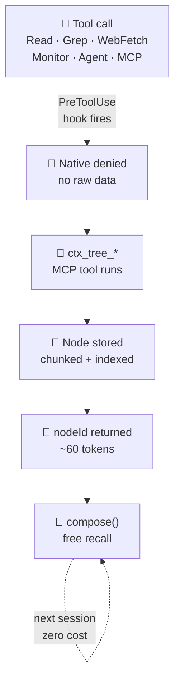

# How It Works

ctx-tree sits between Claude Code and every tool call. This page explains the full pipeline from tool interception to context-efficient recall.

:::tip Interactive visualization
For a click-to-inspect visualization of every node type, hook, pipeline, and search pattern, see the **[How It Works interactive walkthrough](/how-it-works.html)**.
:::

---

## The interception pipeline



When Claude calls a native tool (`Read`, `Grep`, `WebFetch`, `Bash` with grep/cat), the `pretooluse-redirect.mjs` hook fires and **blocks the native call**. It emits a `hookSpecificOutput.additionalContext` message telling Claude to use the equivalent `ctx_tree_*` tool instead. No raw data enters the context window.

---

## Node lifecycle

Every piece of content stored in ctx-tree is a **node**. Nodes have a lifecycle managed by background walkers:

```
pending  →  live  →  stale  →  superseded  →  pruned
```

- **pending**: inserted but not yet indexed by FTS5
- **live**: indexed and searchable
- **stale**: source file has changed (mtime-based for file chunks), or older than `retention.staleHours`
- **superseded**: a newer version of the same source exists (linked via `supersedes` edge)
- **pruned**: eligible for deletion by the pruner walker

---

## Chunking (ctx_tree_read)

When a file is read, ctx-tree uses **tree-sitter semantic chunking** to split it into meaningful units:

1. Parse the file with the appropriate tree-sitter grammar
2. Walk the AST and split at function/class/declaration boundaries
3. Each chunk becomes a `file_chunk` node with `parent_id` pointing to the file's root node
4. Chunks are stored with their line range in metadata

For files without a tree-sitter grammar, a fallback line-based chunker splits at configurable line counts.

---

## FTS5 indexing

All node content is indexed in a SQLite FTS5 virtual table. `ctx_tree_search` runs a BM25-ranked full-text query across all live nodes. Filters by `kind`, `status`, `since`, and `until` narrow the result set.

---

## BFS composition (ctx_tree_compose)

`ctx_tree_compose` is the recall primitive. Given seed node IDs and a token budget:

1. **BFS expansion**: Walk the graph from the seed nodes, traversing edges up to `depth` hops
2. **Relevance scoring**: If a `query` is provided, score nodes by BM25 similarity; otherwise score by recency
3. **Budget packing**: Sort by score descending, include nodes until the budget is exhausted
4. **Format**: Return either raw concatenated content (`raw`) or a structured outline (`outline`)

The result is a dense, budget-bounded context block containing only the most relevant content.

---

## Conversation capture

Two hooks capture the full conversation structure:

- **`userpromptsubmit-capture.mjs`**: Stores each user prompt as a `prompt` node, wired to the preceding `response` via a `follows` edge
- **`stop-response-capture.mjs`**: Reads the session transcript on Stop, stores `thinking` and `response` nodes, wires the full `follows` + `derived_from` chain

This creates a traversable conversation graph in the store. Subagents can be primed with prior conversation context via `ctx_tree_compose`.

---

## Agent enrichment

Before an `Agent` tool call fires, `pretooluse-agent-enrich.mjs`:

1. Runs a FTS search against the store using terms extracted from the agent prompt
2. Injects the top matching node IDs and a tool map into the subagent prompt
3. The subagent starts with context about what the parent session has already read

After the agent completes, `posttooluse-agent-capture.mjs` creates a `summary` node covering everything the subagent touched, with `summarizes` edges to the relevant file and output nodes.

---

## Background walkers

Four walkers run in the background alongside the MCP server:

| Walker | Interval | Purpose |
| ------ | -------- | ------- |
| Staleness | 30s | Marks file_chunk nodes stale when source mtime changes |
| Deduplication | 60s | Merges near-duplicate content (same hash) |
| Summarization | on threshold | Creates summary nodes when a subtree exceeds N nodes |
| Pruner | 5m | Deletes pruned-status nodes past retention window |

Walkers run on independent intervals and never block tool calls. They read and write via the same SQLite connection with WAL mode enabled.
