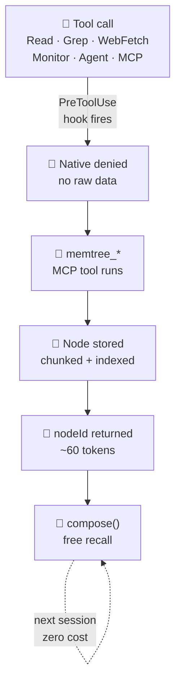

<div align="center">

# 🌳 memtree

### Your sessions die before the work is done.

*Every Read, Grep, and WebFetch dumps raw data into the context window — permanently. memtree intercepts every call, stores the result in a persistent graph, and returns a 60-token reference instead. Same file next week: free.*

[](https://github.com/joeblackwaslike/memtree/blob/main/LICENSE)
[](#development)
[](https://bun.sh)
[](https://github.com/joeblackwaslike/mcp-exec)

</div>

---

Your Claude session is doing real work — reading source files, grepping for symbols, fetching docs, spawning agents. And every single one of those tool calls is **dumping raw data straight into the context window.**

By the time you're 60% through a complex task, the window is stuffed with file contents that already answered their question, grep output nobody needs anymore, and a web page from two subtasks ago. Claude starts forgetting the beginning. You lose the thread. The session dies before the work is done.

**That's context rot. Every developer using Claude Code hits it. memtree aims to eliminate it.**

Every tool call — native *and* MCP — is intercepted by a hook, the result is stored in a persistent SQLite property graph, and Claude gets back a compact `nodeId` reference instead of raw bytes. The same file read next week costs zero tokens. It's already in the graph.

---

## Before / After

| Operation | Without memtree | With memtree | Saved |
| --------- | --------------- | ------------ | ----- |
| Read file | ~4,200 tok | ~60 tok | **98.6%** |
| Grep (8 files) | ~8,400 tok | ~160 tok | **98.1%** |
| WebFetch | ~11,000 tok | ~110 tok | **99.0%** |
| MCP tool | ~3,600 tok | ~70 tok | **98.1%** |

Raw data never enters the context window — only compact `nodeId` references do. The graph stores the content; Claude recalls what it needs via `memtree_compose`.

---

## Install

```sh
# Add the marketplace — one-time global setup
/plugin marketplace add joeblackwaslike/agent-marketplace

# Install memtree — MCP server, all 9 hooks, skills configured automatically
/plugin install memtree@agent-marketplace
```

That's it. Start a new Claude Code session. Every tool call is already being intercepted.

**Requirements:** macOS arm64 or Linux x64/arm64 · [Bun ≥1.1](https://bun.sh) · `rg ≥13`

```sh
brew install bun ripgrep          # macOS
curl -fsSL https://bun.sh/install | bash && apt install ripgrep  # Linux
```

---

## What you get

**98–99% context reduction per operation.** Every read, search, and fetch that used to cost thousands of tokens now costs tens. Operations you've already run cost *nothing* — the graph remembers.

**Zero configuration. Total interception.** Ten hooks fire automatically across every native Claude Code tool and every MCP tool you have installed. Nothing slips through. No per-project setup. No flags to flip.

**Knowledge that outlasts the session.** Prior reads, searches, and web fetches are available next week via `memtree_search` and `memtree_compose`. The graph grows with every session. The context stays lean.

---

## How it works



→ **[Interactive walkthrough — every node type, hook, pipeline, and search pattern](/how-it-works.html)**

---

## Explore the docs

- **[Getting Started](/docs/getting-started)** — install, first session, verify it's working
- **[MCP Tools](/docs/reference/mcp-tools)** — `memtree_read`, `memtree_grep`, `memtree_compose`, and all 10 tools
- **[Hooks](/docs/reference/hooks)** — all 10 hooks and what they intercept
- **[Graph Schema](/docs/reference/graph-schema)** — node kinds, edge kinds, store layout
- **[Design Spec](/docs/architecture/design-spec)** — full architecture document
